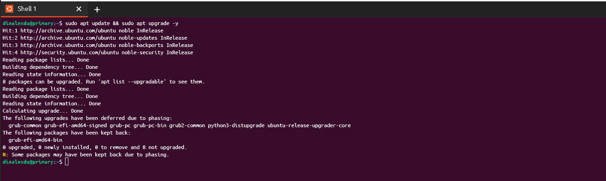
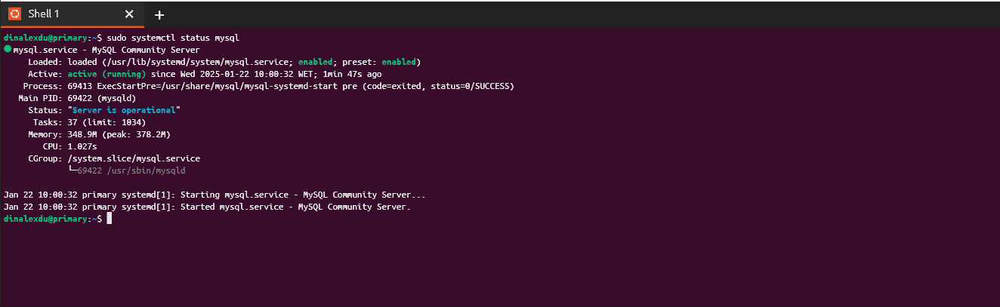
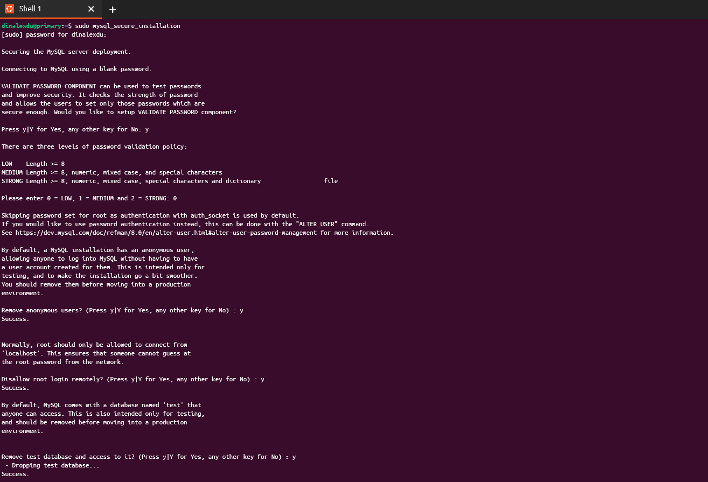
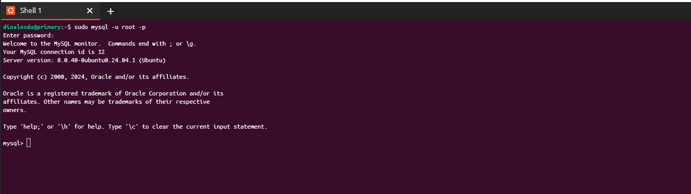
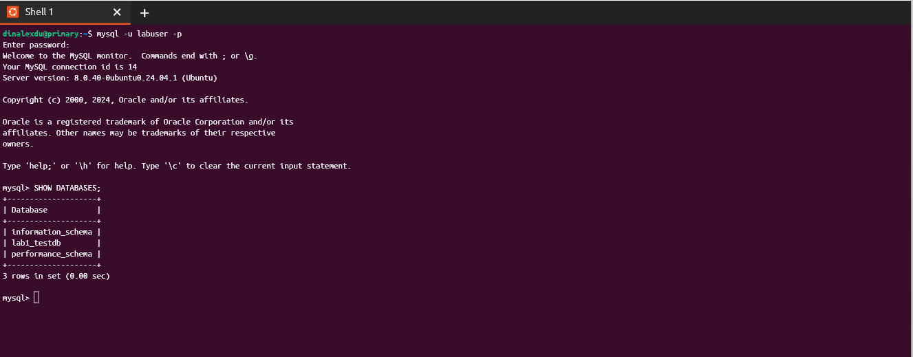

# Lab 1: Basic Setup


## Overview
This lab demonstrates the basic steps to:
- Install MySQL on Ubuntu.
- Configure a secure installation.
- Create a database and user.
- Test the connection with the MySQL server.
  
It is intended for beginners learning MySQL on Linux.


## Steps
1. **Update the system**:
   
   Update and upgrade all packages to the latest versions.
   ```bash
   sudo apt update && sudo apt upgrade -y
   ```
3. **Install MySQL**:
	```bash
	sudo apt install mysql-server -y
	```
4. **Secure MySQL installation**:

   Run the secure installation script to configure MySQL securely.
	```bash
	sudo mysql_secure_installation
	```
6. **Create a database and user**:
   #### Access the MySQL client as the root user:
   	```bash
    	sudo mysql -u root -p
	```
    	
   #### Inside the MySQL client, run the following SQL commands:
	```bash
	CREATE DATABASE lab1_testdb;
	CREATE USER 'labuser'@'localhost' IDENTIFIED BY 'P@ssw0rd';
	GRANT ALL PRIVILEGES ON lab1_testdb.* TO 'labuser'@'localhost';
	FLUSH PRIVILEGES;

	```
7. **Test the connection**:
	```bash
	mysql -u labuser -p
	```
	
## Results
At the end of this lab, you will have:

- A MySQL installation on Ubuntu.
- A secure configuration for MySQL.
- A database named `lab1_testdb`.
- A user `labuser` with full privileges.

  
## Scripts
The SQL commands used in this lab are stored in the following file:
 - scripts/setup-database.sql

## Screenshots

### 1. System Update
#### Command executed to update and upgrade the system.


### 2. Install MySQL
#### Installation of MySQL Server package on Ubuntu.


### 3. Secure Installation
#### MySQL secure installation script successfully completed.


### 4. MySQL Login as Root
#### Accessing the MySQL client as root.


### 5. Create Database and User
#### Commands to create `lab1_testdb` database and `labuser` user executed successfully.


### 6. Test Connection
#### Verified database access with the new user `labuser`.



## Notes
This setup is designed for learning purposes. For production environments, additional security configurations might be required, such as restricting remote access, using SSL/TLS, and implementing monitoring
