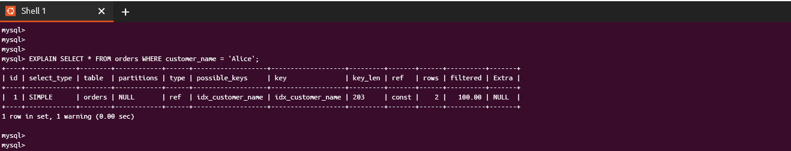
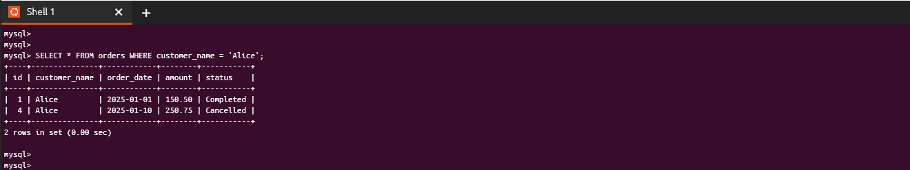

# Lab 5: Optimization

## Overview
This lab demonstrates how to optimize MySQL queries by creating and using indexes, analyzing execution plans, and testing query performance.

---

## Steps

### **Step 1: Prepare the Table**
1. Connect to the `backup_testdb` database:
   ```bash
   mysql -u labuser -p backup_testdb
   ```

2. Create the orders table and insert sample data:

```sql
CREATE TABLE orders (
    id INT AUTO_INCREMENT PRIMARY KEY,
    customer_name VARCHAR(50),
    order_date DATE,
    amount DECIMAL(10,2),
    status VARCHAR(20)
);

INSERT INTO orders (customer_name, order_date, amount, status) VALUES
('Alice', '2025-01-01', 150.50, 'Completed'),
('Bob', '2025-01-05', 200.00, 'Pending'),
('Charlie', '2025-01-07', 300.00, 'Completed'),
('Alice', '2025-01-10', 250.75, 'Cancelled'),
('Bob', '2025-01-15', 175.00, 'Pending');
```

3. Verify the data:

```sql
SELECT * FROM orders;
```

### **Step 2: Create Indexes**

1. Create an index for the customer_name column:

```sql
CREATE INDEX idx_customer_name ON orders(customer_name);
```
2. Create a composite index for order_date and status

```sql
CREATE INDEX idx_order_date_status ON orders(order_date, status);
```
### **Step 3: Analyze Queries with EXPLAIN**

1. Analyze a query using the customer_name index:
```sql
EXPLAIN SELECT * FROM orders WHERE customer_name = 'Alice';
```
2. Analyze a query using the composite index:

```sql
EXPLAIN SELECT * FROM orders WHERE order_date >= '2025-01-01' AND status = 'Completed';
```
### **Step 4: Test Optimized Queries**

1. Test the optimized query with the customer_name index:

```sql
SELECT * FROM orders WHERE customer_name = 'Alice';
```
2. Test the optimized query with the composite index:

```sql
SELECT * FROM orders WHERE order_date >= '2025-01-01' AND status = 'Completed';
```

## Screenshots

1. **Connect to Database**
   

2. **Create Orders Table**
   

3. **Insert Data into Orders Table**
   

4. **Create Index on Customer Name**
   

5. **Create Composite Index on Order Date and Status**
   

6. **Explain Query Using Customer Index**
   

7. **Explain Query Using Composite Index**
   

8. **Optimized Query Using Customer Index**
   

9. **Optimized Query Using Composite Index**
   


## Results

- The orders table is now indexed, optimizing query performance.
- Queries targeting specific columns (customer_name) or combinations (order_date and status) execute faster.
- Execution plans show the utilization of indexes.

## Notes

If you later want to remove an index, use the following SQL command:
```sql
DROP INDEX idx_customer_name ON orders;
```

